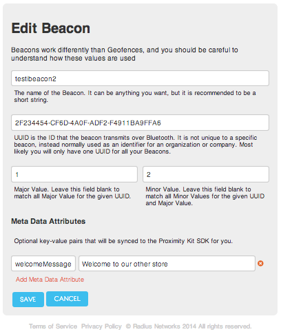
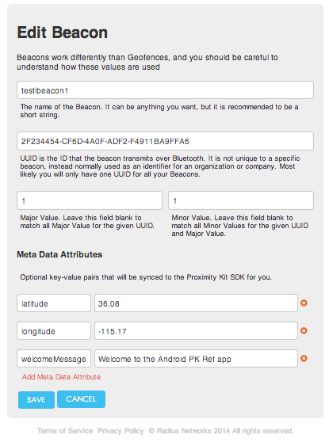

#Android Proximity Reference App

This repository hosts a reference application for using the Pro Android iBeacon Library.  It demonstrates the basic functionality of three core features:

1. Launching the application upon iBeacon detection, and displaying notification messages after the application is launched upon subsequent iBeacon detections.

2. Conserving battery usage by automatically slowing down scans for beacons when the app is in the background.  When no app screen is visible, the app will only look for iBeacons once every 5 minutes in order to save power.

3. Loading iBeacon data from the cloud, using the ProximityKit web service.  The app will display a configurable welcome message from the cloud when an iBeacon is detected with a specific identifiers.

The app is as small and simple as possible to demonstrate basic functionality of the library in an understandable way.  You may use it as the starting point of a more sophisticated app of your own.

##Building the App with AndroidStudo

The app may be built using Android Studio 0.5.2 and Gradle 1.10. Other versions of this software may not compile. Make sure to have Android build tools version 18.1.1 downloaded into your Android SDK Manager as well. 

To build the app, unzip the project file, open Android Studio and select Import Project. Select the build.gradle file within the top level of the project folder and hit OK. Click the Run button or select Run 'AndroidProximityReference' from the Run dropdown menu on the top bar.

##Building the App with Eclipse

Note that this project also contains an Eclipse branch.  Switch to that branch if using Eclipse.

##Running the App

The app may be launched manually, and after the first reboot, it will launch itself automatically the first time an iBeacon is detected.  After launch, subsequent iBeacon detections cause notifications to be sent to the user, and tapping on the notification brings up the app.

When in the foreground, the app displays a list of the identifiers of all iBeacons detected, along with a cloud-configured welcome message for each beacon, if one is set up.

You can run the app as-is in Android Studio (using the master branch w/ Android Studio 0.5.2 and Gradle 1.10) or on Eclipse (using the Eclipse branch).  The reference app has the library already bundled, and is configured to connect to a test account on ProximityKit.com to fetch iBeacon configuration data.

The test ProximityKit account has the iBeacon configurations shown below, which decide the beacon identifiers that trigger the app, and the messages that get displayed to the user.

##Testing with Your Beacons

In order to trigger the welcome messages using the test ProximityKit cloud account configured with the app, set up two iBeacons with the following identifiers:

    Proximity UUID: 2F234454-CF6D-4A0F-ADF2-F4911BA9FFA6
    Major: 1
    Minor: 1

    ProximityUUID: 2F234454-CF6D-4A0F-ADF2-F4911BA9FFA6
    Major: 1
    Minor: 2

##Customizing the App

You may change these configurations to suit your needs by setting up your own ProximityKit account, and placing your ProximityKit.properties file into this project to replace the one provided.

When hooking up the reference app with your own ProximityKit account, take care to set up your iBeacon identifiers properly to match your hardware, and add a key/value pair to each beacon to set the "welcomeMessage" to be displayed for each beacon.

##Test Account iBeacon Configurations

